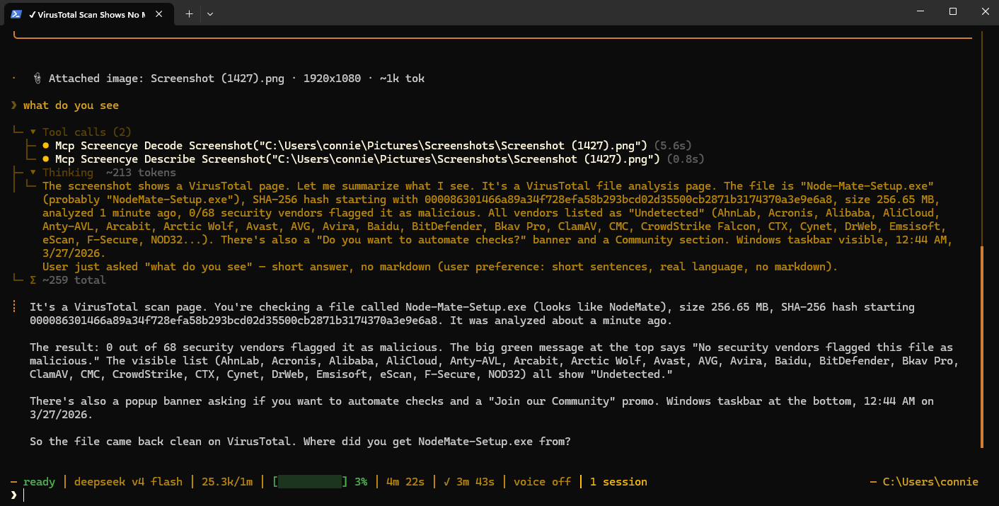

# screencye — eyes for text-only LLMs

**Decode a screenshot into exact structured text so any text-only model can "see" your UI — words, coordinates, sizes, colors, spacing. Pure-code CV + OCR. Zero VRAM. Deterministic.**

Give a screenshot to a text-only model (DeepSeek, a local model, Claude Code, Hermes, etc.) and it can now reason about exact positions instead of hallucinating them — because the screenshot was decoded into a transcript with precise measurements.

```
┌ CARD "Welcome back ..." at (431,197) 418×406 · fill #ffffff
  │ TEXT "Welcome back" at (556,240) 168×19 · #111827
  ┌ INPUT "you@example.com" at (468,341) 344×40 · fill #ffffff
  ┌ BUTTON "Log in" at (467,517) 346×46 · fill #2563eb · text #ffffff
```

Here's a text-only agent (Hermes) using both tools — `decode_screenshot` + `describe_screenshot` — to answer "what do you see?":



## Why it exists

- **Text-only models can't see screenshots** — and describing a misaligned button in words is error-prone.
- **Vision models steal VRAM** — a local vision encoder (like Gemma's `--mmproj`) lives in GPU memory even when idle, squeezing the text model.
- **screencye runs on CPU** — the decode is pure code + PaddleOCR via ONNX Runtime. No GPU, no network, no vision model in the reading path. All your VRAM stays with your text model. (The optional `describe_screenshot` tool uses a tiny on-CPU MobileCLIP2-S2 classifier — still zero VRAM.)

## Skip the vision encoder — save the VRAM

Running a local vision-language model in llama-server (Qwen-VL, Gemma 3, LLaVA, MiniCPM-V)? That `--mmproj` flag is its **vision encoder** — a separate projector file (~0.8–1.1 GB) sitting in VRAM on top of the LLM, even when you're only reading text.

For reading screens you don't need a vision **model** — you need the **information** in the image. screencye turns any screenshot into exact text (words, coordinates, colors, spacing) with a ~21 MB on-device engine and deterministic pixel analysis. **Zero VRAM. Runs on CPU.**

Drop `--mmproj`, run the model text-only, and let screencye do the looking:

| Setup | VRAM |
|---|---|
| Qwen-VL / Gemma 3 with `--mmproj` | full model + ~0.8–1.1 GB projector |
| Text-only model + screencye MCP | no projector; screen reading happens on CPU |

Same ability to read a UI at a fraction of the memory — and because the decode is **exhaustive and deterministic**, nothing is silently missed the way a vision encoder's selective attention can skip details.

> If your job is *understanding* arbitrary images — a photo's subject, a chart's trend — keep the vision model. screencye is for **screens**: exact, complete, and nearly free to run.

## How it works (no AI in the decode)

1. **OCR** — PaddleOCR v5 mobile (ONNX Runtime, ~21 MB) reads every word with a bounding box + confidence.
2. **Layout** — pure pixel code: Sobel edges, color-quantized flood fill, connected components → finds buttons, inputs, cards.
3. **Inference** — geometric heuristics classify each box (centered text in a bordered box = button, etc.).
4. **Transcript** — computed coordinates, spacing, alignment, colors; rendered as a nested tree in reading order.

Deterministic: same screenshot → byte-identical transcript, every time.

## Install

### CLI (any agent or script)

```bash
npm install -g screencye-mcp
screencye /path/to/screenshot.png
```

### MCP server (Claude Code, Hermes, etc.)

Add to your agent's MCP config (`claude mcp add` or the client's MCP settings):

```json
{
  "mcpServers": {
    "screencye": {
      "command": "screencye-mcp",
      "args": []
    }
  }
}
```

Then any agent can call the `decode_screenshot` tool with a file path and get the transcript.

### Model files

The PaddleOCR models (~21 MB) are resolved in this order:

1. `SCREENCYE_MODEL_DIR` env var (explicit override)
2. `<install>/models/` (drop the files here to bundle)
3. A sibling `screenshot-reader/models/` folder (shared dev copy)

Grab the OCR models from the [browser project](https://github.com/PaddlePaddle/PP-OCRv5_mobile_det_onnx) (det) and [rec](https://github.com/PaddlePaddle/PP-OCRv5_mobile_rec_onnx) + the [ppocrv5_dict.txt](https://raw.githubusercontent.com/PaddlePaddle/PaddleOCR/main/ppocr/utils/dict/ppocrv5_dict.txt).

**MobileCLIP2-S2 (semantic tagger for `describe_screenshot`)** is bundled in `models/` (fp16, ~68 MB — the file that ships with this repo on GitHub):
- `mobileclip-vision.onnx` — the vision encoder (256×256 input → 512-d embedding)
- `mobileclip-labels.json` — precomputed label embeddings (no tokenizer/text model needed at runtime)

The label list lives in `scripts/build_labels.py` (one-time build: tokenizes labels and runs the MobileCLIP text encoder; needs the text ONNX, ~250 MB, from [RuteNL/MobileCLIP2-S2-OpenCLIP-ONNX](https://huggingface.co/RuteNL/MobileCLIP2-S2-OpenCLIP-ONNX)). The `screenshot-reader/models/` copy is an int8 variant (~38 MB) for the browser app's IONOS 50 MB/file limit.

**Bigger models (S3/S4, higher zero-shot accuracy) are NOT bundled** — their fp16 exports exceed GitHub's 100 MB/file limit, so they can't ship in this repo. Power users can point `SCREENCYE_MODEL_DIR` at an S3/S4 `mobileclip-vision.onnx` (from [RuteNL/MobileCLIP2-S3-OpenCLIP-ONNX](https://huggingface.co/RuteNL/MobileCLIP2-S3-OpenCLIP-ONNX) or [S4](https://huggingface.co/RuteNL/MobileCLIP2-S4-OpenCLIP-ONNX)) for a ~3–5% zero-shot accuracy boost.

## Tools

| Tool | Input | Output |
|---|---|---|
| `decode_screenshot` | `path` (absolute file path) | Structured transcript (words, coords, colors, spacing) |
| `describe_screenshot` | `path` (absolute file path) | Top semantic labels (MobileCLIP2-S2: "login page", "dashboard", "map", "game", …) |

`describe_screenshot` classifies against ~96 broad labels (UI types, games, photos, documents, charts, code, media, abstract). If no label clears the confidence threshold it appends a **LOW CONFIDENCE** warning instead of forcing a guess — so a blind model isn't misled while debugging. The label list lives in `scripts/build_labels.py`.

## Privacy

Everything runs locally. The screenshot never leaves the machine — no API calls, no data egress.

## Test

```bash
npm test        # parity + structure + determinism on golden screenshots
node test/mcp-handshake-test.mjs   # full MCP handshake
```

## Files

| File | Purpose |
|---|---|
| `src/decoder.js` | The 5-pass deterministic decoder (Node port) |
| `src/server.mjs` | MCP server (stdio) with `decode_screenshot` |
| `src/cli.js` | CLI entry (`screencye image.png`) |
| `src/config.js` | Model-path resolution |

## Roadmap

- `decode_screenshot_base64` — pass image bytes directly (no temp file needed)
- screenshot capture helper

---

Powered by VELOCE AI Accelerator · ONNX Runtime · PaddleOCR
